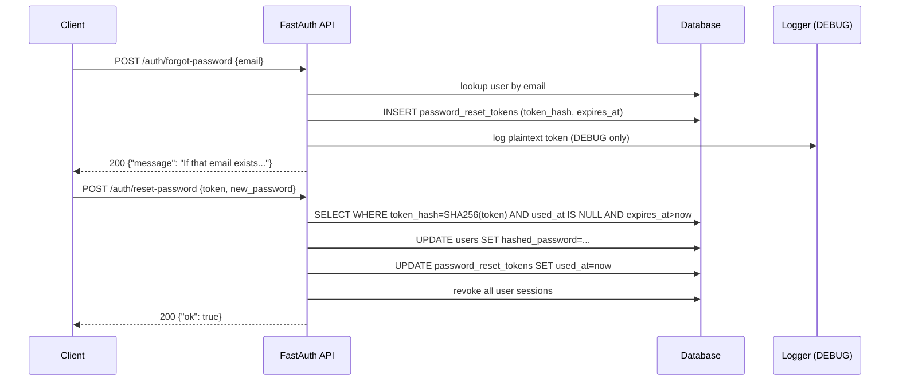

# Auth Hardening & Missing Features


Ten gaps were identified after the initial production-grade auth implementation. This plan closes them in priority order: critical auth endpoints first, then encryption at rest, then the reset flow, OAuth client management, security fixes, and finally RS256/Pydantic migrations. Each phase is independently deployable.

## 1. Requirements & Constraints

- **REQ-001**: `POST /auth/logout` must revoke the caller's current session from the access token's JTI
- **REQ-002**: `POST /auth/change-password` must verify the current password before accepting the new one
- **REQ-003**: MFA TOTP secrets and social provider tokens must be encrypted at rest with AES-256 (Fernet) keyed from `SECRET_KEY`
- **REQ-004**: Forgot-password flow must issue a time-limited signed token (10 min), never expose the raw token in logs
- **REQ-005**: OAuth clients must be creatable/listable/revocable via API without raw SQL
- **REQ-006**: Rate limiter must also key on authenticated `user_id`, not just IP
- **REQ-007**: OAuth state parameter must be stored (Redis or DB) and validated on callback to prevent CSRF
- **REQ-008**: Password history must reject the last 5 passwords on change/reset
- **REQ-009**: JWKS endpoint must return a real public key when RS256 mode is enabled
- **REQ-010**: All Pydantic v2 deprecation warnings (class-based `Config`) must be eliminated
- **CON-001**: All changes must be backward-compatible — existing JWT tokens must continue to work
- **CON-002**: HS256 must remain the default; RS256 is opt-in via `ALGORITHM=RS256` env var
- **CON-003**: Fernet encryption key is derived from `SECRET_KEY` — no new env var required
- **SEC-001**: Reset tokens must be single-use and invalidated on first use
- **SEC-002**: `POST /auth/change-password` must be rate-limited (5/min per user)

## 2. Implementation Steps

> **Agent instructions**: This repo uses git (not jj). Before each phase, create a new branch or commit. After completing all tasks in a phase, commit with `git add -A && git commit -m "<type>: <phase summary>"`. Update checkboxes to `[x]` as each task is completed.

---

### Phase 1: Core Auth Endpoints

**Goal**: Add the two most commonly expected auth endpoints that are entirely absent — logout and change-password.

- [x] TASK-001: Add `POST /auth/logout` to `app/auth/router.py`. Decode the bearer access token, extract `jti` from its payload, call `session_service.revoke_session(session, jti, current_user.id)`, and return `{"ok": true}`. If no session exists for the JTI, still return 200 (idempotent).
- [x] TASK-002: Add `POST /auth/change-password` to `app/auth/router.py`. Accept `{current_password, new_password}`. Verify `current_password` against `current_user.hashed_password` via `verify_password`; if it fails return 401. Hash and save the new password. Emit `AuditEvent.PASSWORD_CHANGED`. Rate-limit to 5/min.
- [x] TASK-003: Add `ChangePasswordRequest` Pydantic model to `app/auth/models.py` with fields `current_password: str` and `new_password: str` (apply same validators as `RegisterRequest.password`).
- [x] TASK-004: Update `app/auth/deps.py` — change `make_tokens` to embed the session's JTI in the access token payload (`"jti"` claim) so `/auth/logout` can look up the session without a separate DB call for the session ID.
  > Note: Updated `session_service.create_session` instead, since login already uses it. JTI is now embedded in access token payload.
- [x] TASK-005: Emit `AuditEvent.LOGOUT` in the logout handler after revocation.

**Completion criteria**: `POST /auth/logout` returns 200 and subsequent `POST /auth/refresh` with the same refresh token returns 401. `POST /auth/change-password` with wrong current password returns 401; with correct password returns 200 and old password no longer works on login.

**Commit**: `git add -A && git commit -m "feat: add logout and change-password endpoints"`

---

### Phase 2: Encryption at Rest (SEC-001)

**Goal**: Actually encrypt the values stored in `secret_encrypted` (MFA) and `access_token_encrypted` / `refresh_token_encrypted` (social accounts) — currently stored as plaintext despite the column name.

- [x] TASK-006: Add `app/core/encryption.py` with `encrypt(plaintext: str) -> str` and `decrypt(ciphertext: str) -> str` using `cryptography.fernet.Fernet`. Derive a 32-byte Fernet key from `settings.secret_key` via `base64.urlsafe_b64encode(hashlib.sha256(settings.secret_key.encode()).digest())`.
- [x] TASK-007: Update `app/auth/mfa/router.py` `POST /auth/mfa/setup`: call `encrypt(secret)` before passing `encrypted_secret=` to `mfa_service.enable_mfa`. Update `verify_totp` call sites to `decrypt(mfa.secret_encrypted)` before passing to pyotp.
- [x] TASK-008: Update `app/auth/sessions/device_info.py` and `app/auth/social/router.py` social callback: call `encrypt(access_token)` / `encrypt(refresh_token)` before storing in `UserSocialAccount`. Update any read path that decrypts them.
- [x] TASK-009: Add `cryptography` to `pyproject.toml` dependencies (`uv add cryptography`).
- [x] TASK-010: Write a one-time migration helper comment in `app/core/encryption.py` explaining how to re-encrypt existing rows if deploying to a DB that already has plaintext values.

**Completion criteria**: After setup, `SELECT secret_encrypted FROM user_mfa_secrets` returns a Fernet ciphertext (`gAAAAA...`) not a base32 secret. TOTP verification still works (encrypt/decrypt round-trip is correct).

**Commit**: `git add -A && git commit -m "feat: encrypt MFA secrets and social tokens at rest"`

---

### Phase 3: Forgot-Password / Reset Flow

**Goal**: Let users reset their password via a signed email token — standard for any auth system.

- [x] TASK-011: Add `password_reset_tokens` table migration `migrations/versions/2000000007_add_password_reset_tokens.py` with columns: `id UUID PK`, `user_id FK`, `token_hash VARCHAR(64)`, `expires_at TIMESTAMP`, `used_at TIMESTAMP nullable`. Index on `token_hash`.
- [x] TASK-012: Add `PasswordResetToken` SQLModel in `app/auth/db_models.py`.
- [x] TASK-013: Add `POST /auth/forgot-password` to `app/auth/router.py`. Accept `{email}`. Look up user; if found, generate `secrets.token_urlsafe(32)`, hash it with SHA-256, store in `password_reset_tokens` (expires 10 min), and log the plaintext token at `DEBUG` level only (never INFO/ERROR). Return `{"message": "If that email exists, a reset link was sent"}` regardless of whether the user exists (prevents enumeration).
- [x] TASK-014: Add `POST /auth/reset-password` to `app/auth/router.py`. Accept `{token, new_password}`. Hash the incoming token, look it up in `password_reset_tokens` where `used_at IS NULL AND expires_at > now`. If valid, update `user.hashed_password`, set `used_at = now`, revoke all sessions (`session_service.revoke_all_user_sessions`), emit `AuditEvent.PASSWORD_RESET`.
- [x] TASK-015: Add `ForgotPasswordRequest` and `ResetPasswordRequest` models to `app/auth/models.py`.

**Completion criteria**: `POST /auth/forgot-password` always returns 200. `POST /auth/reset-password` with a valid token updates the password and returns 200. Replaying the same token returns 400. An expired token returns 400.

**Commit**: `git add -A && git commit -m "feat: add forgot-password and reset-password flow"`

---

### Phase 4: OAuth Client Management API

**Goal**: Allow OAuth clients to be registered via API instead of raw SQL. The `oauth_clients` table exists but has no management endpoints.

- [x] TASK-016: Add `POST /admin/oauth/clients` (admin-only) to `app/admin/router.py`. Accept `{name, redirect_uris: list[str], scopes: list[str], is_confidential: bool}`. Generate a UUID `client_id` and a `client_secret` (32-byte hex, returned once and never stored in plaintext — store its bcrypt hash). Return `{client_id, client_secret}`.
- [x] TASK-017: Add `GET /admin/oauth/clients` — list all clients (no secrets). Add `GET /admin/oauth/clients/{client_id}` — get one. Add `DELETE /admin/oauth/clients/{client_id}` — revoke (soft-delete via `is_active=False`).
- [x] TASK-018: Add `OAuthClientCreateRequest`, `OAuthClientResponse` to `app/admin/models.py`.
- [x] TASK-019: Update `app/auth/oauth/dependencies.py` `client_authenticated` to verify the incoming `client_secret` against the stored hash (currently it does a direct string compare via `OAuthClient.client_secret`).
- [x] TASK-020: Add `is_active: bool` column to `OAuthClient` in `app/auth/db_models.py` and a new migration `2000000008_add_oauth_client_active.py`. Filter inactive clients out of all lookups.

**Completion criteria**: Admin can `POST /admin/oauth/clients`, receive a `client_id`+`client_secret`, then successfully use those credentials in `POST /oauth/token` Basic auth. `DELETE /admin/oauth/clients/{id}` causes subsequent token requests to fail with 401.

**Commit**: `git add -A && git commit -m "feat: add OAuth client management API"`

---

### Phase 5: Security Fixes

**Goal**: Close three active security gaps — per-user rate limiting, OAuth state CSRF protection, and password history.

- [x] TASK-021: Update `app/core/ratelimit.py` `RateLimiter.__call__` to optionally key on user ID. If the request has a valid Bearer token, extract `sub` and add a second key `rl:{method}:{path}:user:{user_id}` checked in addition to the IP key.
- [x] TASK-022: In `app/auth/social/router.py` `GET /{provider}/authorize`: store the generated `state` value in Redis (key `social:state:{state}`, TTL 10 min) or an in-memory cache. In `GET /{provider}/callback`: validate that the incoming `state` exists in the store before processing; delete it after validation. Return 400 if state is missing or unknown.
- [x] TASK-023: Implement `app/auth/security/password_history.py` properly. Add `password_history` table migration `2000000009_add_password_history.py` with columns `id UUID PK`, `user_id FK`, `hashed_password TEXT`, `created_at TIMESTAMP`. Add `PasswordHistory` SQLModel to `app/auth/db_models.py`.
- [x] TASK-024: In `check_password_not_reused`: query the last 5 `PasswordHistory` rows for `user_id` and call `verify_password(new_password, row.hashed_password)` for each — return `False` if any match. In `add_password_to_history`: insert a new row, then delete rows beyond the 5 most recent.
- [x] TASK-025: Wire `check_password_not_reused` into `POST /auth/change-password` (Phase 1) and `POST /auth/reset-password` (Phase 3) — return 400 with `"Password was recently used"` if check fails.

**Completion criteria**: Sending 6+ login requests from the same authenticated user triggers 429 before the IP limit is reached. OAuth callback with a fabricated `state` returns 400. Changing to a previously used password returns 400.

**Commit**: `git add -A && git commit -m "fix: per-user rate limiting, OAuth state CSRF, password history"`

---

### Phase 6: RS256/JWKS & Pydantic v2

**Goal**: Make JWKS serve a real public key when RS256 is enabled, and eliminate all Pydantic v2 deprecation warnings.

- [x] TASK-026: Update `app/core/config.py` — add `algorithm: str = "HS256"` (already exists) and `rsa_private_key_path: str | None = None`. If `algorithm == "RS256"` and `rsa_private_key_path` is set, load the PEM key at startup.
- [x] TASK-027: Update `app/core/security.py` `create_token`/`decode_token` to use the RSA private/public key when `settings.algorithm == "RS256"`. Use `python-jose`'s RSA support (`algorithms=["RS256"]`).
- [x] TASK-028: Update `app/auth/oauth/jwks.py` `get_jwks()` — if `settings.algorithm == "RS256"`, extract the public key's `n`, `e`, `kid` and return a proper JWK object. If HS256 (default), keep returning `{"keys": []}`.
- [x] TASK-029: Fix Pydantic v2 deprecation in `app/auth/sessions/models.py` `SessionResponse` — replace `class Config: orm_mode = True` with `model_config = ConfigDict(from_attributes=True)`.
- [x] TASK-030: Same fix for `app/auth/rbac/models.py` `RoleResponse` and `PermissionResponse`.
- [x] TASK-031: Same fix for `app/admin/models.py` `UserListResponse`, `UserDetailResponse`, and any other affected models. Run `uv run pytest` and confirm zero Pydantic deprecation warnings remain.

**Completion criteria**: `uv run pytest` passes with 0 `PydanticDeprecatedSince20` warnings. With `ALGORITHM=RS256` and a valid RSA key path, `GET /.well-known/jwks.json` returns a JWK with `kty=RSA`. HS256 mode is unchanged.

**Commit**: `git add -A && git commit -m "feat: RS256/JWKS support and fix Pydantic v2 deprecation warnings"`

---

## 3. Alternatives Considered

- **ALT-001**: Use a separate `ENCRYPTION_KEY` env var for Fernet — rejected because deriving from `SECRET_KEY` avoids new operational burden; rotating `SECRET_KEY` naturally forces re-encryption.
- **ALT-002**: Store OAuth state in the DB instead of Redis — rejected because state is ephemeral (10 min), Redis TTL handles cleanup automatically without a cron job.
- **ALT-003**: Implement email sending for forgot-password — deferred because FastAuth doesn't have an email service configured; the reset token is logged at DEBUG level so operators can use it directly or wire their own mailer.
- **ALT-004**: Switch to RS256 by default — rejected because it adds key management complexity for operators who don't need OIDC federation; HS256 is simpler and secure for first-party use.

## 4. Dependencies

- **DEP-001**: `cryptography` — Fernet AES-256 encryption (Phase 2)
- **DEP-002**: `python-jose[cryptography]` — already installed; RS256 requires the `[cryptography]` extra (Phase 6)
- **DEP-003**: Redis — required for OAuth state storage in Phase 5; falls back to in-memory dict if Redis unavailable (with warning)

## 5. Affected Files

- **FILE-001**: `app/auth/router.py` — add logout, change-password, forgot-password, reset-password endpoints
- **FILE-002**: `app/auth/models.py` — add ChangePasswordRequest, ForgotPasswordRequest, ResetPasswordRequest
- **FILE-003**: `app/auth/deps.py` — embed JTI in access token (TASK-004)
- **FILE-004**: `app/core/encryption.py` — new file: Fernet encrypt/decrypt helpers
- **FILE-005**: `app/core/security.py` — RS256 support in create_token/decode_token
- **FILE-006**: `app/core/config.py` — add rsa_private_key_path setting
- **FILE-007**: `app/core/ratelimit.py` — per-user rate limiting key
- **FILE-008**: `app/auth/mfa/router.py` — encrypt/decrypt TOTP secret
- **FILE-009**: `app/auth/social/router.py` — OAuth state store + validate
- **FILE-010**: `app/auth/security/password_history.py` — full implementation replacing stub
- **FILE-011**: `app/auth/oauth/jwks.py` — real JWK output for RS256
- **FILE-012**: `app/auth/oauth/dependencies.py` — bcrypt hash check for client_secret
- **FILE-013**: `app/auth/db_models.py` — PasswordResetToken, PasswordHistory, OAuthClient.is_active
- **FILE-014**: `app/admin/router.py` — OAuth client CRUD endpoints
- **FILE-015**: `app/admin/models.py` — OAuthClientCreateRequest, OAuthClientResponse; fix Pydantic config
- **FILE-016**: `app/auth/sessions/models.py` — fix Pydantic config
- **FILE-017**: `app/auth/rbac/models.py` — fix Pydantic config
- **FILE-018**: `migrations/versions/2000000007_add_password_reset_tokens.py` — new
- **FILE-019**: `migrations/versions/2000000008_add_oauth_client_active.py` — new
- **FILE-020**: `migrations/versions/2000000009_add_password_history.py` — new

## 6. Testing

- [ ] TEST-001: `tests/test_auth.py` — add `test_logout_revokes_session`: login → logout → refresh should return 401
- [ ] TEST-002: `tests/test_auth.py` — add `test_change_password_wrong_current`: POST change-password with bad current_password → 401
- [ ] TEST-003: `tests/test_auth.py` — add `test_change_password_success`: POST change-password → 200; login with old password → 401; login with new password → 200
- [ ] TEST-004: `tests/test_auth.py` — add `test_forgot_reset_flow`: POST forgot-password → 200; extract token from debug log or DB; POST reset-password → 200; replay same token → 400
- [ ] TEST-005: `tests/test_security.py` — add `test_oauth_state_replay`: attempt callback with fabricated state → 400
- [ ] TEST-006: `tests/test_security.py` — add `test_password_history_reuse`: change password → change back to original → 400
- [ ] TEST-007: `tests/test_mfa_integration.py` — add `test_totp_secret_is_encrypted_in_db`: after MFA setup, query DB directly and assert value starts with `gAAAAA` (Fernet prefix)
- [ ] TEST-008: `uv run pytest tests/ --ignore=tests/load -W error::DeprecationWarning` — zero Pydantic warnings

## 7. Risks & Assumptions

- **RISK-001**: Fernet key derivation from `SECRET_KEY` means rotating `SECRET_KEY` breaks decryption of existing MFA secrets and social tokens — mitigation: document this explicitly; provide a re-encryption script before any key rotation.
- **RISK-002**: Embedding JTI in access tokens (TASK-004) changes the token format — existing tokens without JTI will still decode correctly (logout will just be a no-op for them) — mitigation: handle missing `jti` gracefully in the logout handler.
- **RISK-003**: OAuth state stored in Redis — if Redis is down, social logins temporarily fail — mitigation: fall back to a short-lived in-memory dict with a warning log.
- **ASSUMPTION-001**: The `cryptography` package is not yet in `pyproject.toml` — if already installed transitively, `uv add` will just pin the version.
- **ASSUMPTION-002**: RS256 is optional; most deployments will stay on HS256 and Phase 6 tasks 026–028 are a no-op for them.

## 8. Architecture Diagram

### Password Reset Flow



### Encryption at Rest

```
MFA Setup                          MFA Verify
──────────────────────────────     ────────────────────────────
secret = generate_secret()         ciphertext = db.secret_encrypted
ciphertext = encrypt(secret)  →    secret = decrypt(ciphertext)
db.secret_encrypted = ciphertext   verify_totp(secret, code)
```

### OAuth State CSRF Protection

```
/authorize                         /callback
─────────────────────────         ────────────────────────────────
state = token_urlsafe(16)          state = query_param("state")
Redis.set(                         if not Redis.get(
  f"social:state:{state}",           f"social:state:{state}"):
  ttl=600                              raise 400 "Invalid state"
)                                  Redis.delete(f"social:state:{state}")
redirect → provider?state=         proceed with code exchange
```

## 9. Related Specs & Further Reading

- `docs/production-grade-auth/PLAN.md` — original 12-phase implementation this plan builds on
- `docs/security/best_practices.md` — operational guidance for secrets and rotation
- [OWASP Authentication Cheat Sheet](https://cheatsheetseries.owasp.org/cheatsheets/Authentication_Cheat_Sheet.html)
- [RFC 7636 — PKCE](https://datatracker.ietf.org/doc/html/rfc7636)
- [RFC 7517 — JSON Web Key](https://datatracker.ietf.org/doc/html/rfc7517)
